# 👋 Olá, eu sou o Kelwin!

🎓 **Estudante de Ciência da Computação**  
💻 **Desenvolvedor Backend em formação**  
☕ **Java | Spring Boot | PostgreSQL**

Sou estudante de Ciência da Computação e desenvolvedor backend em formação, com foco no ecossistema Java.

Gosto de transformar problemas em soluções através de código, buscando escrever aplicações organizadas, testáveis e próximas das práticas utilizadas no desenvolvimento profissional.

Atualmente, estou focado em evoluir como desenvolvedor backend e busco uma oportunidade de estágio para colocar meus conhecimentos em prática.

---

## 🚀 Sobre mim

```java
public class Kelwin {

    String curso = "Ciência da Computação";
    String foco = "Desenvolvimento Backend";

    String[] principaisTecnologias = {
        "Java",
        "Spring Boot",
        "Spring Data JPA",
        "Hibernate",
        "PostgreSQL"
    };

    String objetivo =
        "Tornar-me um desenvolvedor backend cada vez melhor";
}
```

---

## 🛠️ Stack

### ☕ Backend


### 🗄️ Banco de Dados


### 🧪 Testes e Qualidade


### 🐳 Ferramentas


---

# 🚀 Projeto em Destaque

## 🛒 Supermarket Management API

API REST desenvolvida com **Java 21** e **Spring Boot 4** para simular o backend de um sistema de gerenciamento de supermercado.

O projeto aplica conceitos utilizados em aplicações backend reais, incluindo arquitetura em camadas, persistência relacional, validação, tratamento de exceções, testes, documentação e containerização.

### ✨ Funcionalidades

- 🛍️ CRUD de produtos
- 🏷️ CRUD de categorias
- 👤 Gerenciamento de clientes
- 📦 Controle de estoque
- 🛒 Carrinho de compras
- ➕ Adição e alteração de itens
- ➖ Remoção de itens
- 🧮 Cálculo automático de subtotais
- 💰 Cálculo do valor total
- 🧾 Conversão de carrinho em venda
- 📊 Histórico de vendas
- 📉 Baixa automática de estoque
- ✅ Validação de disponibilidade
- ⚠️ Tratamento global de exceções
- 📋 Validação com Jakarta Validation
- 📚 Documentação com Swagger / OpenAPI
- 🧪 Testes com JUnit 5 e Mockito
- 📈 Cobertura com JaCoCo
- 🔎 Análise com SonarCloud
- 🐳 PostgreSQL executado com Docker Compose

### 🏗️ Arquitetura

```text
src
└── main
    └── java
        └── com.exemplo.meu_primeiro_projeto
            ├── controller
            ├── service
            ├── repository
            ├── model
            ├── dto
            ├── exception
            ├── specification
            └── util
```

### 🧰 Tecnologias

```text
Java 21
Spring Boot 4
Spring Data JPA
Hibernate
Jakarta Validation
PostgreSQL
H2 Database
JUnit 5
Mockito
JaCoCo
Swagger / OpenAPI
Docker
Docker Compose
Maven
Git
SonarCloud
```

### 🔗 Repositório

[](https://github.com/kelwin-feitosa/supermarket-management-api)

---

# 💰 Outro Projeto

## Simulador de Empréstimos Bancários

Aplicação Java desenvolvida para simular empréstimos bancários, com foco em precisão matemática e organização da lógica de negócio.

### Principais conceitos

- `BigDecimal`
- `RoundingMode.HALF_UP`
- JDBC
- PostgreSQL
- Validação de dados
- Exceções personalizadas
- Separação de responsabilidades

[](https://github.com/kelwin-feitosa/simulador-emprestimo-java)

---

# 📚 Atualmente estudando

- Spring Security
- JWT
- BCrypt
- Flyway
- Testes de integração
- Testcontainers
- Docker
- Concorrência
- Microsserviços
- Arquitetura de Software
- Integração com Inteligência Artificial

---

## 📊 GitHub

<div align="center">




</div>

---


# 📫 Onde me encontrar

<div align="center">

[](https://www.linkedin.com/in/kelwinfeitosa)

[](mailto:kelwinfeitosa@gmail.com)

</div>

---

<div align="center">

### ☕ Transformando café em código.

</div>
